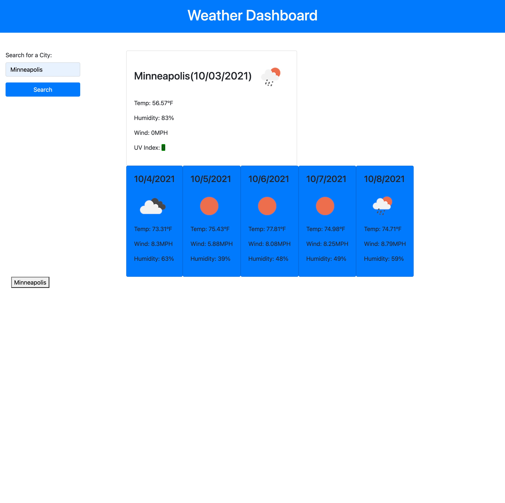

# Homework 6: weather-dashboard

## Objective:

The objective of this assignment was to create a weather dashboard that uses the Open Weather Api to fetch the current weather for a city as well as the 5-day forecast. After the user has searched one city, the city is saved to local storage and then a button is created to allow the user to return to a previous search.

To start, I created an HTML file with the outline of the elements needed for the dashboard. Next, I created a JavaScript file to use functions to fetch the data from the API and display the information to the user. 

## Screenshot of Homepage

## Link to deployed code
https://kesjoberg.github.io/weather-dashboard/